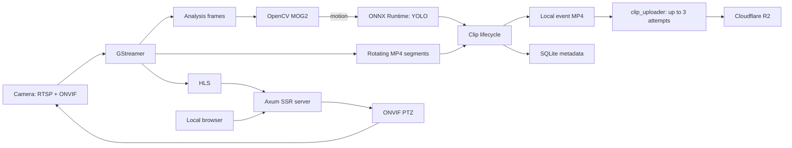

# Camwatch

Rust application for local network camera monitoring.

## Architecture



For the full architecture and MVP scope, see [the project guide](docs/README.md).

## Running

```sh
cargo run -p camwatch-server -- --config config/camwatch.example.toml
```

The TOML configuration stores only non-sensitive data and names of environment variables that hold secrets, such as `CAMWATCH_FRONT_DOOR_RTSP_URL`. Do not put passwords, tokens, or RTSP URLs with credentials in it.

The default panel address is `127.0.0.1:8080`. To deliberately change the configuration path, pass `--config` or set the `CAMWATCH_CONFIG` environment variable.

The local panel uses the `CAMWATCH_USER_LOGIN` and `CAMWATCH_USER_PASSWORD` environment variables when both are set. If neither is set, local development uses `admin` / `admin`. Setting only one variable or setting either variable to an empty value prevents startup.

MP4 segments are written below `segment_directory`, in a separate directory for every camera. `segment_rotation_seconds` determines when GStreamer requests the next segment; the actual boundary is the next keyframe of the camera stream.

At startup, cameras from TOML are upserted into the SQLite database at `database_path`. The application then loads all active cameras from SQLite, which remains the source of truth for cameras and segment metadata.
