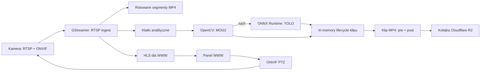

# Camwatch — dokument przewodni

## Cel

Camwatch to lokalna aplikacja Rust do nadzorowania kamer sieciowych. Odbiera obraz RTSP, wykrywa ruch, potwierdza obecność osoby przez model YOLO, zapisuje klipy ze zdarzeń i wysyła je do skonfigurowanego bucketa Cloudflare R2. Udostępnia też chroniony hasłem panel WWW z podglądem kamer i sterowaniem PTZ.

Pierwsza wersja jest przeznaczona dla jednej do czterech kamer Tapo w tej samej sieci LAN oraz dla jednego użytkownika administracyjnego.

## Dokumenty

- [Backlog spec-driven](tasks.md) — kolejność implementacji, zależności i kryteria akceptacji.
- [Specyfikacja backendu SSR](backend-ssr.md) — podział crate'ów, SSR, widoki i logowanie.
- [Lokalna fake camera](fake-camera.md) — MediaMTX i testowy stream FFmpeg do ręcznego uruchamiania Camwatch.

## Zakres MVP

1. Konfiguracja wielu kamer RTSP i ONVIF.
2. Stabilne pobieranie obrazu oraz automatyczne ponowne łączenie po zerwaniu strumienia.
3. Wykrywanie ruchu przez MOG2, osobne dla każdej kamery.
4. Wykrywanie osób przez YOLO uruchamiane wyłącznie po wykryciu ruchu.
5. Rotacyjny bufor nagrań obejmujący ostatnie `X` sekund.
6. Klip MP4 zawierający materiał sprzed oraz po zdarzeniu.
7. Asynchroniczna wysyłka klipu do Cloudflare R2 z ponawianiem po błędzie.
8. Panel WWW: logowanie, lista kamer, podgląd HLS, PTZ i bieżący stan aplikacji.

## Poza zakresem MVP

- Dostęp publiczny przez Internet bez reverse proxy i TLS.
- Aplikacja mobilna.
- Rozpoznawanie twarzy, śledzenie konkretnych osób i analiza audio.
- Nagrywanie w chmurze bez lokalnego bufora.
- Obsługa kamer bez RTSP lub ONVIF.

## Architektura



Aplikacja jest jednym procesem Rust z modułami, a nie zbiorem mikroserwisów. Każda kamera ma własnego nadzorcę strumienia, model MOG2 i stan zdarzenia. Awaria pojedynczej kamery nie może zatrzymać pozostałych.

## Odpowiedzialności technologii

| Obszar | Wybór | Rola |
| --- | --- | --- |
| RTSP, HLS i segmenty MP4 | GStreamer przez `gstreamer-rs` | Odbieranie, dekodowanie, segmentacja i podgląd przeglądarkowy |
| Ruch | OpenCV przez crate `opencv` | MOG2, morfologia maski i kontury |
| Osoby | `ort` + YOLO w ONNX | Inferencja osób na klatkach po wykryciu ruchu |
| PTZ | klient ONVIF | Odczyt możliwości kamery przy starcie oraz komendy ruchu i zatrzymania |
| HTTP i WWW | `axum` | API, sesje, HLS i prosty panel |
| Metadane | SQLite przez `sqlx` | Kamery i segmenty bufora |
| Cloudflare R2 | S3-compatible API | Autoryzacja i odporna wysyłka MP4 |

## Przepływ zdarzenia

1. Nadzorca kamery pobiera RTSP i zapisuje krótkie segmenty, domyślnie po dwie sekundy.
2. Strumień analityczny dostarcza obniżoną liczbę klatek na sekundę do MOG2.
3. Ruch spełniający próg powierzchni uruchamia YOLO na kilku klatkach.
4. In-memory lifecycle rozpoczyna lub rozszerza bieżący klip; wynik YOLO dodaje etykietę `person` i pewność.
5. Po okresie ciszy aplikacja kompletuję klip z segmentów `pre_event_seconds` przed zdarzeniem i `post_event_seconds` po nim.
6. Klip jest zapisany lokalnie i trafia do in-memory kolejki uploadu.
7. Wysyłka do Cloudflare R2 działa w tle. Błąd nie usuwa lokalnego klipu i powoduje maksymalnie trzy próby z narastającym opóźnieniem.

## Wymagania funkcjonalne

| Id | Wymaganie |
| --- | --- |
| FR-01 | Użytkownik może dodać, edytować, wyłączyć i usunąć kamerę RTSP/ONVIF. |
| FR-02 | Dla każdej aktywnej kamery aplikacja utrzymuje połączenie RTSP i automatycznie je odnawia. |
| FR-03 | Aplikacja wykrywa ruch przez MOG2 oraz ignoruje szum zgodnie z konfiguracją. |
| FR-04 | Po ruchu aplikacja wykonuje detekcję osób YOLO i utrzymuje wynik w bieżącym lifecycle klipu. |
| FR-05 | Aplikacja zachowuje konfigurowalny pre-buffer i tworzy MP4 z materiałem przed oraz po zdarzeniu. |
| FR-06 | Aplikacja utrzymuje bieżący lifecycle klipu i uploadu wyłącznie w pamięci procesu. |
| FR-07 | Aplikacja wysyła ukończone klipy MP4 do skonfigurowanego bucketa Cloudflare R2, pod określonym prefiksem obiektów. |
| FR-08 | Panel WWW wymaga hasła aplikacji przed dostępem do kamer i bieżącego stanu aplikacji. |
| FR-09 | Panel pokazuje podgląd każdej kamery w przeglądarce. |
| FR-10 | Panel umożliwia PTZ dla kamer, które zgłaszają obsługę tej funkcji w ONVIF. |

## Wymagania niefunkcjonalne

| Id | Wymaganie |
| --- | --- |
| NFR-01 | Utrata RTSP jednej kamery nie może zatrzymać pozostałych kamer ani panelu WWW. |
| NFR-02 | Klip zdarzenia nie może utracić materiału z okresu pre-bufferu po zwykłym restarcie procesu. |
| NFR-03 | Hasła kamer, klucze dostępu R2 i hasło panelu nie mogą trafiać do logów ani zwykłego pliku konfiguracyjnego. |
| NFR-04 | Panel domyślnie nasłuchuje na `127.0.0.1`; ekspozycja do LAN wymaga świadomej konfiguracji. |
| NFR-05 | Wysyłka do R2 wykonuje ograniczoną liczbę prób w ramach życia procesu i nie usuwa lokalnego klipu po błędzie. |
| NFR-06 | Aplikacja ma logować stan kamer, aktywnych klipów i prób uploadu w sposób wystarczający do diagnozy. |

## Konfiguracja docelowa

Konfiguracja niesekretna będzie przechowywana w TOML. Sekrety będą wskazywane przez nazwy zmiennych środowiskowych i odczytywane dopiero podczas uruchamiania aplikacji.

```toml
[app]
bind_address = "127.0.0.1:8080"
pre_event_seconds = 10
post_event_seconds = 20
rolling_buffer_seconds = 30
r2_enabled = false
r2_endpoint_env = "CAMWATCH_R2_ENDPOINT"
r2_access_key_id_env = "CAMWATCH_R2_ACCESS_KEY_ID"
r2_secret_access_key_env = "CAMWATCH_R2_SECRET_ACCESS_KEY"
r2_bucket_env = "CAMWATCH_R2_BUCKET"
r2_prefix_env = "CAMWATCH_R2_PREFIX"
r2_region_env = "CAMWATCH_R2_REGION"

[[cameras]]
id = "front-door"
name = "Front door"
rtsp_url_env = "CAMWATCH_FRONT_DOOR_RTSP_URL"
rtsp_codec = "h264"
onvif_url = "http://192.168.1.65:2020/onvif/device_service"
onvif_credentials_env = "CAMWATCH_FRONT_DOOR_ONVIF_CREDENTIALS"
motion_min_area = 1000
yolo_confidence = 0.50
```

Nazwy zmiennych środowiskowych dla Cloudflare R2 są konfigurowane w TOML-u, natomiast ich wartości są pobierane z env. Przy `r2_enabled = false` używany jest NoOp uploader i pliki nie są wysyłane do R2.

```text
CAMWATCH_R2_ENDPOINT
CAMWATCH_R2_ACCESS_KEY_ID
CAMWATCH_R2_SECRET_ACCESS_KEY
CAMWATCH_R2_BUCKET
CAMWATCH_R2_PREFIX
CAMWATCH_R2_REGION
```

## Zasady bezpieczeństwa

- Hasło panelu jest przechowywane wyłącznie jako hash Argon2id.
- Klucze dostępu Cloudflare R2 i dane kamer są sekretami, nie wpisami w repozytorium.
- Logi maskują URL-e RTSP i nagłówki autoryzacyjne.
- Endpointy PTZ i pliki HLS są dostępne wyłącznie po zalogowaniu.
- Dostęp z urządzeń w LAN powinien działać przez HTTPS, najlepiej za Caddy lub innym reverse proxy.

## Decyzje do podjęcia przed rozpoczęciem implementacji

1. Platforma wdrożeniowa: macOS, Linux czy oba systemy.
2. Docelowa liczba i rozdzielczość kamer.
3. Czy wykrycie samego ruchu zawsze wysyła klip, czy upload ma następować wyłącznie po wykryciu osoby.
4. Docelowy czas pre-bufferu i post-bufferu.
5. Czy panel będzie dostępny wyłącznie na tym samym komputerze, czy w całym LAN.
